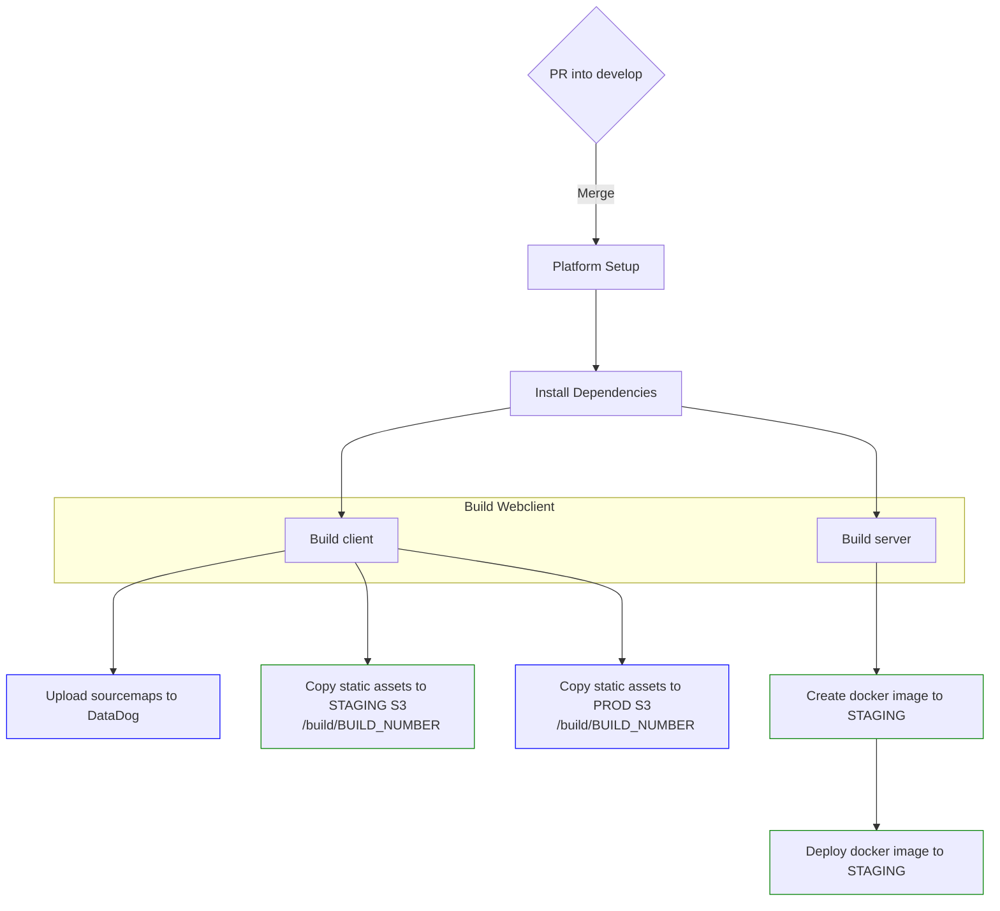
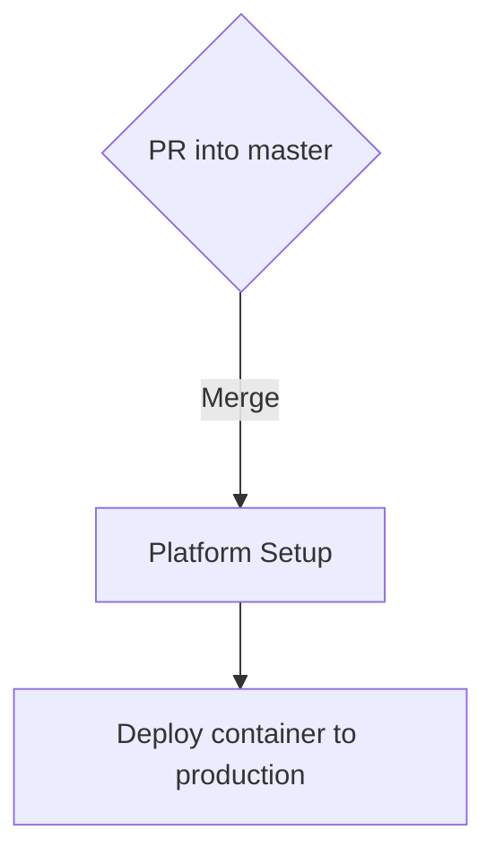

# Release Process

In the process of migrating webclient to [BODA](https://gousto.atlassian.net/wiki/spaces/TECHPOTATOES/pages/3682730007/BODA+Build+Once+Deploy+Anywhere) we've had to re-assess how we deploy webclient.

Although our platform tooling now supports [BODA for ECS](https://gousto.atlassian.net/wiki/spaces/TECHPOTATOES/pages/3738501237/How+to+upgrade+your+ECS+service+to+BODA), **it does not handle migration of static assets (js bundles, images, fonts etc.) from an S3 bucket in one environment to another** - this is a requirement for webclient.

## BODA deployment flow
_Note: this chart does not include tests/checks_

### Staging workflow

**Summary**

- Webclient is configured **at build time** to consume static assets from s3, using path `/build/[BUILD_NUMBER]`, where `BUILD_NUMBER` is the `CIRCLE_BUILD_NUM` of the CircleCI build job.
- The staging workflow is responsible for uploading static assets to **both staging and production s3 buckets**. This is not a risk, because assets are copied into a unique directory that is not yet used in production.
- The staging workflow is also responsible for uploading source-maps to DataDog - these are also used in production, but are not yet consumed by DataDog until the production deployment (the SDKs are configured to use `CIRCLE_BUILD_NUM` for `version`)

### Production workflow

**Summary**

- Webclient container is promoted to production using platform's BODA tooling
- The newly deployed production container consumes static assets from S3 that were deployed during the staging workflow

## Extra

The above approach moves away from the app consuming static assets from S3 with directory `/build/latest` - this is inherently risky, as:

- This creates an implicit **hard** dependency on our webpack config continuing to generate hash-based filenames for static assets. Without these, there's a risk that assets uploaded to the production S3 bucket may interfere with the currently deployed app's assets.

