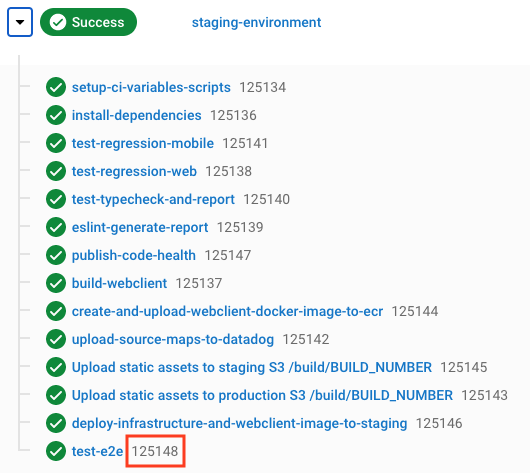

# Cypress e2e tests

> **THIS WORK IS CURRENTLY EXPERIMENTAL**
>
> **SEE [FEF-583](https://gousto.atlassian.net/browse/FEF-583)**

This test suite is an experiment to attempt to achieve better stability, ease of debugging, performance, and extensibility.

## Commands

_Note: the following commands should be run from the root of this repo_

**Run tests (headfully)**

```bash
yarn workspace e2e-cypress cypress:open
```

**Run tests (headlessly)**

```bash
yarn workspace e2e-cypress test
```

**Lint test suite**

```bash
yarn workspace e2e-cypress lint
```

**Type-check test suite**

```bash
yarn workspace e2e-cypress type-check
```

## Tests

- `signupWithCard.spec` - tests new user signup journey from homepage, finishing in checkout **with card payment**

## Technical Decisions

- Test runner: [Cypress 10](https://www.cypress.io/)
- Testing utilities: [Cypress Testing Library](https://testing-library.com/docs/cypress-testing-library/intro/) for easy user-centric testing
- Design pattern: [Page Object Model](https://www.toolsqa.com/cypress/page-object-pattern-in-cypress/)
- Typescript
- Instrumentation/debugging: [DataDog RUM](https://app.datadoghq.eu/rum/list)

## Instrumentation/debugging

This test suite is instrumented with DataDog Real User Monitoring (RUM) for ease of debugging and analysing test data over time.

DD RUM is initialised after invocation of `cy.visit` (see [here](https://github.com/Gousto/gousto-webclient/blob/276c1d1527c8ba397b762cdc71ac5bfb00e253ba/tests/e2e-cypress/support/overwrites.ts#L7-L9)).

_Note: DD is only enabled for test runs on CI_

### DataDog test context

Currently the following data has been added to the DataDog global RUM context, and is searchable in the DataDog UI:

| key          | description                                                              |
| ------------ | ------------------------------------------------------------------------ |
| `testName`   | Name of test                                                             |
| `build`      | CircleCI build number - see image below, build number highlighted in red |
| `testRunner` | Name of test runner, used to differentiate between old e2e suite         |



#### Adding to DataDog test context

You can enrich the test context with additional data using the following command:

```ts
cy.addDDContext('isInUserBucket', true)
```
